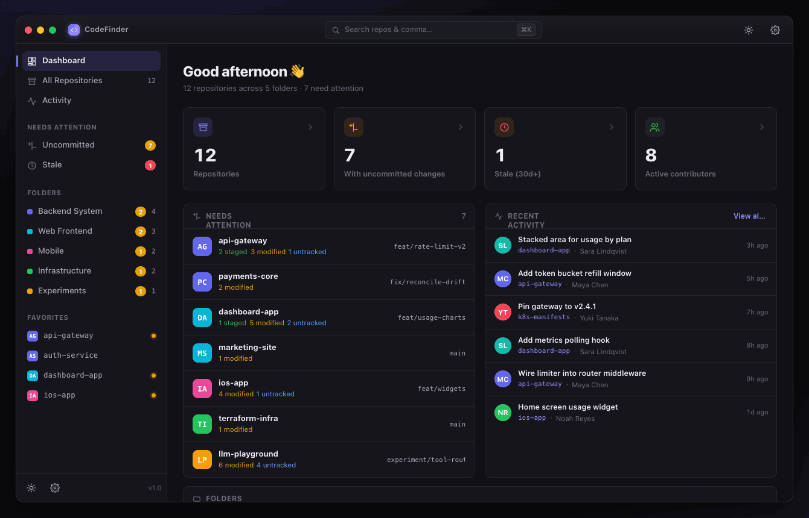

# CodeFinder

> **Stop hunting through Finder.** Organize your local git repositories into folders, see commits, branches and contributors at a glance, and launch any repo in your favorite editor — all from one fast, keyboard-first macOS app.



---

## Why

If you clone a lot of repos, your `~/Code` folder turns into a swamp. Finder doesn't know what a git repo is, doesn't show you which ones have uncommitted work, and opening the right project in the right editor means digging through nested folders every time.

**CodeFinder** treats your repositories as first-class objects. Group them into folders that match how you think (`Backend System`, `Web Frontend`, `Infrastructure`…), glance at their git state, and open them where you want — in one keystroke.

## Features

- 📁 **Folders, your way** — organize repos into custom folders instead of fighting the filesystem.
- 🔭 **Rich repo detail** — commits, branches, contributors, working-tree status, languages, README and remote, all in one panel.
- 🚀 **Open in any IDE** — auto-detects installed editors (VS Code, Cursor, Xcode, Zed, JetBrains, Sublime…) and lets you add any editor by path, GitHub-Desktop style.
- ⚡ **Quick git actions** — fetch, pull, open in terminal or reveal in Finder without leaving the app.
- 🎯 **Smart groups** — instantly see repos with **uncommitted changes** or that have gone **stale**.
- 📊 **Dashboard & activity feed** — an at-a-glance overview plus a cross-repo commit timeline.
- ⌘ **Command palette** — hit `⌘K` to jump to any repo or run any command. Fully keyboard-driven.
- 🌓 **Dark & light themes** — built dark-first, with a clean light mode and accent customization.


## Status

🚧 **Early development.** The interactive UI is built; the native backend (filesystem scanning + git access) is in progress. The current prototype runs in the browser with sample data.

## Tech stack

| Layer | Choice | Why |
|-------|--------|-----|
| **UI** | HTML + CSS + React | Polished, themeable, reuses the existing prototype |
| **Shell** | [Tauri](https://tauri.app/) | Native OS webview, tiny binaries (~5–10 MB), secure |
| **Backend** | Rust | Filesystem scanning + git logic |
| **Git** | [`git2`](https://docs.rs/git2) (libgit2) | Fast, structured commit/branch/status data — no shelling out |
| **Packaging** | `tauri-cli` | Standalone `.app` bundle |

## Backend API (planned contract)

The React frontend calls Rust through Tauri commands (e.g. `invoke("list_repos", { folderId })`):

```rust
#[tauri::command] fn list_folders() -> Vec<Folder>;
#[tauri::command] fn list_repos(folder_id: String) -> Vec<RepoSummary>;
#[tauri::command] fn get_repo_detail(path: String) -> RepoDetail;
#[tauri::command] fn get_commits(path: String, branch: String) -> Vec<Commit>;
#[tauri::command] fn get_status(path: String) -> WorkingTreeStatus;
#[tauri::command] fn detect_ides() -> Vec<Editor>;
#[tauri::command] fn open_in(ide_id: String, path: String) -> Result<(), String>;
#[tauri::command] fn fetch(path: String) -> Result<SyncResult, String>;
#[tauri::command] fn pull(path: String) -> Result<SyncResult, String>;
```

Structs (`Folder`, `RepoSummary`, `RepoDetail`…) derive `serde::Serialize` so they cross the IPC bridge to the UI as plain JSON.

## Getting started

### Prerequisites
- macOS 13+
- [Rust toolchain](https://rustup.rs/) (stable)
- [Node.js](https://nodejs.org/) 18+ and [pnpm](https://pnpm.io/) — for the frontend and Tauri CLI

### Run in development
```bash
# clone
git clone https://github.com/<you>/codefinder.git
cd codefinder

# install frontend deps (also pulls in the Tauri CLI)
pnpm install

# run — compiles the Rust backend and launches the webview with hot reload
pnpm tauri dev
```

### Build a release `.app`
```bash
pnpm tauri build
# output: src-tauri/target/release/bundle/macos/CodeFinder.app
```

### Permissions
On first launch macOS will ask for **Files and Folders** access so CodeFinder can read your repositories. For scanning folders anywhere on disk, grant **Full Disk Access** in System Settings → Privacy & Security.

## Roadmap

- [ ] Drag-and-drop repos between folders
- [ ] Auto-import: scan a parent directory and add every git repo found
- [ ] Live refresh on file changes (`notify` crate)
- [ ] Per-repo custom default editor
- [ ] Tags / labels in addition to folders
- [ ] Search inside commit messages across all repos

## License

**Copyright © 2026 — All rights reserved.**

This is proprietary software. The source is published for reference only; no license
to use, copy, modify, or distribute is granted. See [`LICENSE`](LICENSE) for details.
